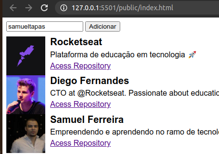

# API to consult github repository using ES6
> API to search repositories on github, using es6 javascript

## Release History
0.1.0
O primeiro lançamento adequado
MUDANÇA: README.md added
0.0.1
Trabalho em andamento

## Meta
Samuel Ferreira de Oliveira Costa – @samueltapas_ – samuel.sfoc@gmail.com

A project with student purposes to aply my knowledge about Javascript

https://github.com/samueltapas/consult-repository-api-github
